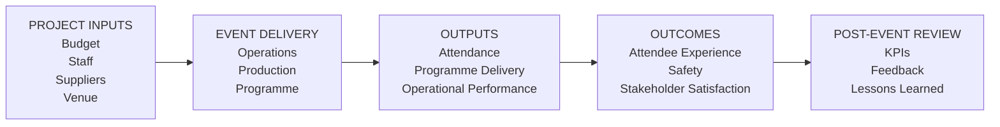

# KPI & Performance Dashboard – Warehouse Worship: The Gathering 2026

## 1. Purpose

This KPI and Performance Dashboard provides an illustrative framework for measuring the success of a large-scale worship event.

The dashboard focuses on project delivery, operations, attendee experience, safety, programme performance, financial control and stakeholder outcomes.

All targets in this document are **proposed portfolio targets** and are not claimed to represent actual Warehouse Worship performance data.

---

## 2. KPI Framework

Event performance can be assessed across seven key areas:

1. Attendance
2. Attendee Experience
3. Operations
4. Safety
5. Programme & Production
6. Financial Management
7. Stakeholder Performance

---

## 3. KPI Dashboard

| Performance Area | KPI | Proposed Target | Actual Result | Status |
|---|---|---:|---|---|
| Attendance | Attendance against forecast | ≥95% | Not available | Not measured |
| Attendee Experience | Attendee satisfaction | ≥85% | Not available | Not measured |
| Operations | Average entry wait | <30 mins | Not formally measured | Not measured |
| Ticketing | Successful ticket scans | ≥99% | Not available | Not measured |
| Safety | Critical safety incidents | 0 | Not available | Not measured |
| Safety | Blocked emergency exits | 0 | Not available | Not measured |
| Programme | Programme delivered on schedule | ≥95% | Not available | Not measured |
| Production | Major technical failures | 0 | Not available | Not measured |
| Staffing | Staff briefing completion | 100% | Not available | Not measured |
| Finance | Budget variance | Within ±5% | Not available | Not measured |
| Stakeholders | Stakeholder satisfaction | ≥85% | Not available | Not measured |

> **Important:** No actual event performance figures are being invented. Where verified data was unavailable, the dashboard records the result as "Not available" or "Not formally measured".

---

## 4. KPI Visual Framework

The following framework shows how event inputs can be connected to outputs and outcomes.

> **Framework note:** This is an illustrative performance-management model created for the portfolio case study.

---

## 5. Attendance KPI

### KPI

**Attendance against forecast**

### Proposed Target

**≥95% of forecast attendance**

### Measurement

Attendance can be calculated as:

**Actual Attendance ÷ Forecast Attendance × 100**

### Data Sources

Potential sources include:

- Ticketing system
- Ticket scans
- Attendance records
- Venue capacity information

### Current Case-Study Status

Actual verified attendance was not available.

Therefore, no actual attendance percentage is claimed.

---

## 6. Attendee Experience KPI

### KPI

**Attendee satisfaction**

### Proposed Target

**≥85% satisfaction**

### Measurement

A post-event survey could measure:

- Overall satisfaction
- Ease of entry
- Venue experience
- Programme experience
- Staff helpfulness
- Safety perception
- Facilities
- Likelihood of attending again

### Potential Data Sources

- Post-event survey
- Online feedback
- Social media feedback
- Direct attendee comments

### Case-Study Observation

The user's first-hand observation identified:

- Significant entry congestion
- A lengthy arrival process
- Clear signage
- Staff communication
- Available toilets and merchandise
- A generally organised internal environment

These observations are qualitative and should not be converted into a numerical satisfaction score.

---

## 7. Entry Operations KPI

### KPI

**Average attendee entry waiting time**

### Proposed Target

**Less than 30 minutes**

### Measurement

Entry waiting time could be calculated from:

**Queue Entry Time → Venue Entry Time**

The average could then be calculated across a representative sample of attendees.

### Case-Study Observation

The user experienced approximately one hour or slightly longer for the overall entry process.

This is a **single first-hand observation**, not a statistically representative measurement of all attendees.

---

## 8. Ticketing KPI

### KPI

**Successful ticket scans**

### Proposed Target

**≥99%**

### Measurement

**Successful Ticket Scans ÷ Total Ticket Scan Attempts × 100**

### Potential Data Sources

- Ticketing platform
- Scanning system
- Entry logs

### Case-Study Status

Actual ticket-scan performance data was not available.

---

## 9. Safety KPI

### KPI

**Critical safety incidents**

### Proposed Target

**0**

Other safety indicators could include:

- Medical incidents
- Security incidents
- Crowd-management interventions
- Emergency evacuations
- Blocked exits

### Measurement

The number of incidents classified as critical could be recorded through event-day incident reports.

### Case-Study Status

No verified internal incident data was available for this case study.

Therefore, no numerical safety-performance result is claimed.

---

## 10. Programme KPI

### KPI

**Programme delivered on schedule**

### Proposed Target

**≥95% of programme delivered within agreed timings**

### Measurement

**Programme Items Delivered on Time ÷ Total Programme Items × 100**

### Potential Data Sources

- Run of Show
- Stage-management records
- Production logs
- Event control records

Published coverage provides information about the programme structure but does not provide a complete verified internal timing record. :contentReference[oaicite:0]{index=0}

Therefore, actual programme performance cannot be calculated from the available evidence.

---

## 11. Production KPI

### KPI

**Major technical failures**

### Proposed Target

**0**

Potential technical systems include:

- Audio
- Lighting
- Screens
- Recording
- Stage systems

### Measurement

Record the number of incidents classified as major technical failures.

### Case-Study Status

No verified internal production incident data was available.

Therefore, no actual technical-performance result is claimed.

---

## 12. Staffing KPI

### KPI

**Staff briefing completion**

### Proposed Target

**100%**

### Measurement

**Staff Briefed ÷ Staff Required × 100**

### Potential Data Sources

- Staff attendance records
- Briefing sign-in sheets
- Volunteer records

### Case-Study Status

Actual staffing records were not available for this case study.

---

## 13. Financial KPI

### KPI

**Budget variance**

### Proposed Target

**Within ±5%**

### Measurement

**Budget Variance = Actual Cost − Planned Cost**

Percentage variance:

**Variance % = (Actual Cost − Planned Cost) ÷ Planned Cost × 100**

### Case-Study Status

The project budget created within this portfolio is illustrative.

No actual Warehouse Worship expenditure figures are available.

Therefore, an actual budget variance cannot be calculated.

---

## 14. Stakeholder KPI

### KPI

**Stakeholder satisfaction**

### Proposed Target

**≥85%**

### Potential Stakeholders

- Event leadership
- Venue
- Production
- Security
- Suppliers
- Artists
- Volunteers
- Partners

### Measurement

Stakeholder satisfaction could be measured using a post-event survey.

Example areas could include:

- Communication
- Coordination
- Supplier performance
- Operational delivery
- Issue resolution
- Overall project experience

Actual stakeholder survey results were not available.

---

## 15. KPI Data Collection

A structured data-collection process could include:

**Data Collection**

↓

**Data Validation**

↓

**KPI Calculation**

↓

**Performance Review**

↓

**Issue Identification**

↓

**Corrective Action**

↓

**Lessons Learned**

---

## 16. KPI Reporting Frequency

| KPI Category | Review Frequency |
|---|---|
| Attendance | Event day / post-event |
| Entry Operations | Event day |
| Safety | Event day / post-event |
| Programme | Event day |
| Production | Event day |
| Staffing | Pre-event / event day |
| Finance | Weekly / post-event |
| Stakeholder Satisfaction | Post-event |
| Attendee Satisfaction | Post-event |

---

## 17. Traffic-Light Reporting

A future project dashboard could use:

| Status | Meaning |
|---|---|
| 🟢 Green | Target achieved / on track |
| 🟡 Amber | Potential issue requiring monitoring |
| 🔴 Red | Target not achieved / corrective action required |
| ⚪ Not Measured | Verified data unavailable |

For this portfolio case study, unavailable actual performance data is deliberately shown as **Not Measured** rather than assigning an unsupported status.

---

## 18. Performance Review

The project team should review KPI performance to identify:

- Areas performing as expected
- Areas requiring additional resources
- Operational bottlenecks
- Safety concerns
- Budget pressures
- Stakeholder concerns
- Opportunities for improvement

KPI results should be considered alongside qualitative feedback.

---

## 19. Corrective Action

Where a KPI falls below its agreed target:

**Target Missed**

↓

**Root Cause Analysis**

↓

**Corrective Action Identified**

↓

**Action Owner Assigned**

↓

**Action Implemented**

↓

**Performance Rechecked**

This creates a continuous improvement cycle.

---

## 20. Post-Event Evaluation

A post-event evaluation should combine quantitative and qualitative evidence.

### Quantitative Evidence

Potential quantitative measures include:

- Attendance
- Ticket scans
- Entry times
- Budget performance
- Programme timings
- Incident records
- Survey results

### Qualitative Evidence

Potential qualitative evidence includes:

- Attendee comments
- Staff feedback
- Supplier feedback
- Stakeholder feedback
- Operational observations

Combining both forms of evidence provides a more complete evaluation.

---

## 21. Case-Study Evidence Classification

| Evidence Type | Example |
|---|---|
| Published / Verified | Event date and public event timings |
| First-Hand Observation | User's arrival and entry experience |
| Illustrative | Proposed KPI targets |
| Not Available | Internal attendance, financial and incident data |

This distinction prevents illustrative portfolio assumptions from being presented as actual event performance.

---

## 22. Key Findings Available from the Case Study

Based on the available evidence, the following observations can be documented.

### Entry

The user's first-hand experience involved a significant queue and a lengthy entry process.

### Signage

The user observed that signage was generally easy to follow.

### Communication

The user observed clear announcements and staff communication.

### Facilities

The user observed access to toilets, merchandise and exit routes.

### Crowd Management

The user perceived the internal crowd environment as relatively controlled, with staff directing attendees.

These are first-hand observations rather than quantitative performance measurements.

---

## 23. Performance Improvement Opportunities

The available observations suggest several areas that could be examined in a future event evaluation.

### Entry Throughput

Compare expected arrival volumes with actual entry capacity, security throughput and ticket-scanning capacity.

### Queue Management

Measure waiting times at different stages of the entry process.

### Attendee Communication

Evaluate whether pre-event information prepared attendees adequately for arrival and entry.

### Crowd Flow

Review movement patterns within the venue and identify potential congestion points.

### Staff Deployment

Assess whether staff were positioned effectively at key attendee decision points.

---

## 24. Lessons for Future Events

The KPI framework could support future event improvement by connecting performance data to operational decisions.

For example:

**Long Entry Times**

↓

**Identify Cause**

↓

**Review Security / Scanning Capacity**

↓

**Adjust Entry Resources**

↓

**Measure Future Entry Performance**

This creates a measurable continuous-improvement process.

---

## 25. Limitations

The case study does not have verified access to:

- Final attendance figures
- Complete ticket-scan data
- Average entry times across all attendees
- Internal incident statistics
- Actual budget performance
- Staff attendance records
- Complete programme timing records
- Internal stakeholder survey results
- Production failure records

Consequently, this dashboard demonstrates a **measurement framework** rather than a claim of actual event performance.

---

## 26. Portfolio Application

This KPI dashboard demonstrates:

- Performance measurement
- KPI development
- Target setting
- Quantitative analysis
- Qualitative evaluation
- Data classification
- Performance reporting
- Corrective action
- Continuous improvement

---

## 27. Conclusion

A structured KPI framework allows an event project to move beyond simply asking whether the event took place.

It provides a method for evaluating:

- Whether the event met its objectives
- Whether operations were effective
- Whether attendees had a positive experience
- Whether safety requirements were maintained
- Whether the programme was delivered effectively
- Whether expenditure remained controlled
- Whether stakeholders were satisfied

The proposed dashboard provides a framework that could be populated with verified event data where such data is available.

---

> **Portfolio disclaimer:** This document is an independent project-management case study based on publicly available information and first-hand attendee observation. KPI targets are illustrative and actual performance figures have not been invented where verified data was unavailable. This document does not claim access to Warehouse Worship's internal performance, financial, attendance, safety or operational data.
