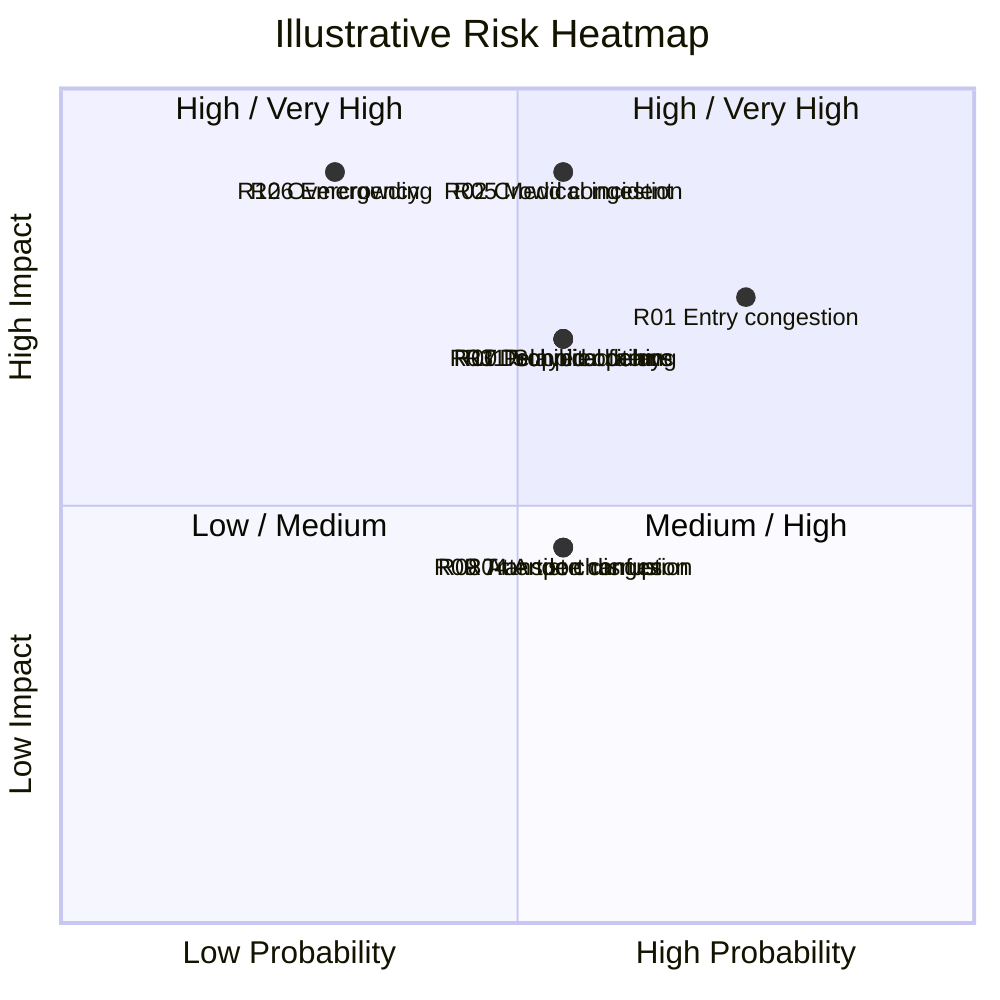

# Risk Register – Warehouse Worship: The Gathering 2026

## 1. Purpose

This risk register identifies potential risks associated with planning and delivering a large-scale worship event.

The register demonstrates how risks could be identified, assessed, prioritised and controlled throughout the project lifecycle.

The risks and scores below are **illustrative project-management assumptions** created for this portfolio case study. They do not represent Warehouse Worship's actual internal risk register or recorded incidents.

---

## 2. Risk Assessment Methodology

Risks are assessed using a 5 × 5 probability and impact scoring system.

### Probability

| Score | Probability |
|---|---|
| 1 | Rare |
| 2 | Unlikely |
| 3 | Possible |
| 4 | Likely |
| 5 | Almost Certain |

### Impact

| Score | Impact |
|---|---|
| 1 | Insignificant |
| 2 | Minor |
| 3 | Moderate |
| 4 | Major |
| 5 | Severe |

### Risk Score

**Risk Score = Probability × Impact**

| Score | Rating |
|---|---|
| 1–4 | Low |
| 5–9 | Medium |
| 10–14 | High |
| 15–25 | Very High |

---

## 3. Risk Register

| ID | Risk | Probability | Impact | Score | Rating | Proposed Mitigation |
|---|---|---:|---:|---:|---|---|
| R01 | Entry congestion and long queues | 4 | 4 | 16 | Very High | Staggered arrival information, sufficient entry lanes, security planning and queue management |
| R02 | Internal crowd congestion | 3 | 5 | 15 | Very High | Crowd monitoring, steward deployment, clear circulation routes and controlled movement |
| R03 | Delayed event opening | 3 | 4 | 12 | High | Pre-opening checks, production schedule and readiness checklist |
| R04 | Artist or programme changes | 3 | 3 | 9 | Medium | Confirm programme early and maintain contingency arrangements |
| R05 | Medical incident | 3 | 5 | 15 | Very High | Medical provision, trained personnel, emergency procedures and clear access routes |
| R06 | Evacuation or major emergency | 2 | 5 | 10 | High | Emergency planning, evacuation procedures, signage and staff briefings |
| R07 | Technical or production failure | 3 | 4 | 12 | High | Equipment testing, technical rehearsals, backup systems and technical support |
| R08 | Attendee confusion | 3 | 3 | 9 | Medium | Clear signage, pre-event information and trained staff |
| R09 | Transport disruption | 3 | 3 | 9 | Medium | Transport information, alternative routes and contingency planning |
| R10 | Prohibited items entering venue | 3 | 4 | 12 | High | Security screening, clear attendee guidance and controlled access |
| R11 | Supplier delay | 3 | 4 | 12 | High | Supplier milestones, contractual requirements and regular progress monitoring |
| R12 | Overcrowding | 2 | 5 | 10 | High | Capacity monitoring, controlled access and crowd-management procedures |

---

## 4. Risk Heatmap

The following heatmap provides a visual representation of the probability and impact scoring methodology.

> **Heatmap note:** The visual positions are illustrative representations of the probability and impact assessments shown in the risk register. They are not based on Warehouse Worship's actual internal risk data.

---

## 5. Highest-Priority Risks

### R01 – Entry Congestion

Entry congestion is a significant operational consideration for a large-scale event.

Potential controls include:

- Clear pre-event arrival information
- Multiple entry points where permitted
- Queue-management systems
- Sufficient security and ticket-scanning resources
- Clear signage
- Staff positioned at key points

---

### R02 – Internal Crowd Congestion

Large attendee numbers can create pressure around entrances, circulation areas, seating and standing areas.

Potential controls include:

- Steward deployment
- Crowd monitoring
- Controlled movement
- Clear circulation routes
- Communication between security and operations teams

---

### R05 – Medical Incident

A medical incident could require immediate intervention and access for emergency personnel.

Potential controls include:

- Dedicated medical provision
- Trained first-aid personnel
- Emergency access routes
- Clear incident procedures
- Communication protocols

---

### R06 – Emergency / Evacuation

A major emergency could require evacuation or other emergency action.

Potential controls include:

- Emergency response plans
- Clearly identified exits
- Staff briefings
- Emergency communication procedures
- Coordination with relevant venue and emergency personnel

---

## 6. Risk Response Strategies

The project could use four main risk response strategies:

### Avoid

Remove the activity or condition creating the risk where practical.

### Reduce

Implement controls that reduce either the probability or impact of the risk.

### Transfer

Transfer some responsibility or financial exposure to another party through contractual arrangements or insurance.

### Accept

Accept the risk where the cost of further mitigation is disproportionate to the potential impact, while continuing to monitor it.

---

## 7. Risk Ownership

Each significant risk should have an assigned owner responsible for monitoring and managing the risk.

| Risk Area | Proposed Risk Owner |
|---|---|
| Entry and crowd congestion | Event Operations / Security Lead |
| Medical incidents | Safety / Medical Lead |
| Emergency response | Event Safety Lead |
| Technical failure | Production Lead |
| Artist changes | Programme / Artist Lead |
| Supplier delays | Procurement / Project Lead |
| Transport disruption | Logistics Lead |
| Attendee communication | Marketing / Attendee Experience Lead |

These ownership assignments are proposed for the portfolio case study.

---

## 8. Risk Monitoring

Risk monitoring should continue throughout the project rather than only during the final preparation stage.

Potential review points include:

- Project planning meetings
- Supplier meetings
- Production reviews
- Security planning meetings
- Venue coordination
- Final readiness checks
- Event-day briefings
- Post-event debrief

---

## 9. Event-Day Risk Controls

On event day, risk management should focus particularly on:

- Entry queues
- Ticket scanning
- Security screening
- Crowd movement
- Emergency exits
- Medical response
- Technical systems
- Staff communication
- Attendee information
- Capacity monitoring

Any significant incident should be recorded and escalated through the agreed operational structure.

---

## 10. Risk Escalation Process

A proposed risk escalation process is:

**Risk / Incident Identified**

↓

**Immediate Assessment**

↓

**Responsible Team Responds**

↓

**Escalate if Required**

↓

**Project / Event Leadership Decision**

↓

**Corrective Action**

↓

**Monitor Outcome**

↓

**Close and Record Lesson Learned**

---

## 11. Risk Review

Risk scores should be reviewed when:

- New information becomes available
- Project scope changes
- Suppliers change
- Programme changes
- Venue arrangements change
- Significant incidents occur
- The event approaches
- Event-day conditions change

A risk that was initially assessed as medium could become high or very high if probability or impact increases.

---

## 12. Key Risk Indicators

Potential indicators that could signal increasing risk include:

| Indicator | Potential Warning Sign |
|---|---|
| Queue length | Increasing waiting times |
| Entry throughput | Scanning rate below expected level |
| Crowd density | Increasing concentration of attendees |
| Staffing | Unfilled operational positions |
| Supplier progress | Missed milestones |
| Technical testing | Repeated equipment failures |
| Transport | Significant delays |
| Emergency access | Obstructed or restricted routes |
| Programme | Increasing schedule delays |

---

## 13. Risk Assumptions and Limitations

The probability, impact and risk scores in this document are illustrative.

They are intended to demonstrate the application of a structured risk-management methodology to a large-scale event.

They do not represent:

- Actual Warehouse Worship risk scores
- Actual recorded incidents
- Actual internal risk owners
- Actual security assessments
- Actual emergency planning documentation
- Actual venue risk assessments

---

## 14. Portfolio Application

This risk register demonstrates:

- Risk identification
- Probability and impact assessment
- Risk prioritisation
- Mitigation planning
- Risk ownership
- Monitoring
- Escalation
- Event-day risk control

It demonstrates how a project manager could use a structured risk-management process to support safer and more controlled event delivery.

---

## 15. Conclusion

Risk management is a continuous project activity that should begin during project planning and continue through event delivery and post-event evaluation.

For a large-scale event, particular attention should be given to crowd management, entry operations, medical provision, emergency response, technical reliability, supplier performance and attendee communication.

The proposed risk register provides a framework for monitoring these areas and assigning appropriate mitigation measures.

---

> **Portfolio disclaimer:** This document is an independent project-management case study based on publicly available information and first-hand attendee observation. The risks, probability scores, impact scores, controls, owners and heatmap positions are illustrative portfolio outputs and do not claim to reproduce Warehouse Worship's actual internal risk-management documentation.
