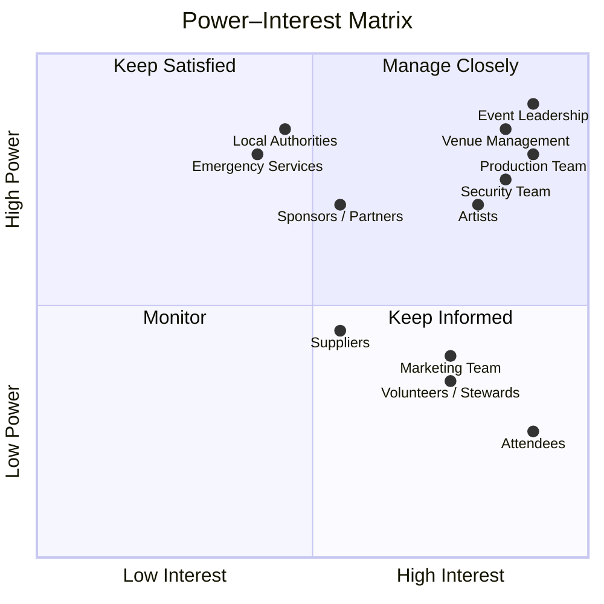

# Stakeholder Management Plan

## 1. Purpose

The stakeholder management plan identifies the key stakeholders involved in a large-scale event project and establishes how they should be managed throughout the project lifecycle.

The stakeholder structure below is an illustrative project-management framework created for this portfolio case study. It does not claim to represent Warehouse Worship's actual internal organisational structure.

---

## 2. Stakeholder Identification

| Stakeholder | Role / Interest | Power | Interest |
|---|---|---|---|
| Event Leadership | Overall project direction and decision-making | High | High |
| Venue Management | Venue access, facilities and compliance | High | High |
| Production Team | Stage, sound, lighting, screens and recording | High | High |
| Security Team | Crowd safety and security | High | High |
| Artists / Performers | Programme delivery and performance requirements | High | High |
| Local Authorities | Licensing, safety and regulatory requirements | High | Medium |
| Emergency Services | Emergency response and public safety | High | Medium |
| Sponsors / Partners | Commercial and strategic interests | High | Medium |
| Attendees | Event experience and accessibility | Low | High |
| Volunteers / Stewards | Event-day support and attendee assistance | Medium | High |
| Suppliers | Delivery of contracted goods and services | Medium | Medium |
| Marketing Team | Promotion and audience engagement | Medium | High |

---

## 3. Power–Interest Matrix

The matrix below provides an illustrative classification of stakeholders according to their level of power and interest.

> **Matrix note:** Stakeholder positions are illustrative assumptions developed for this portfolio case study and do not represent Warehouse Worship's actual stakeholder analysis.

---

## 4. Stakeholder Engagement Strategy

### 4.1 Manage Closely

These stakeholders have high levels of power and interest and require regular communication and active involvement.

- Event Leadership
- Venue Management
- Production Team
- Security Team
- Artists / Performers

Potential engagement methods include:

- Project meetings
- Progress reports
- Technical meetings
- Risk reviews
- Rehearsal coordination
- Escalation procedures
- Decision-making meetings

---

### 4.2 Keep Satisfied

These stakeholders have significant influence but may not require the same level of day-to-day involvement.

- Local Authorities
- Emergency Services
- Sponsors / Partners

Potential engagement methods include:

- Formal updates
- Compliance documentation
- Scheduled meetings
- Approval processes
- Issue escalation
- Progress reporting

---

### 4.3 Keep Informed

These stakeholders have high interest but less decision-making power.

- Attendees
- Volunteers / Stewards
- Marketing Team

Potential engagement methods include:

- Email communication
- Staff briefings
- Event information
- Social media
- Signage
- Operational updates
- Attendee communications

---

### 4.4 Monitor

These stakeholders require appropriate communication without excessive management resources.

- Suppliers
- Wider external stakeholders

Potential engagement methods include:

- Contract updates
- Supplier meetings
- Progress checks
- Issue tracking
- Delivery confirmations

---

## 5. RACI Responsibility Framework

A RACI framework can be used to clarify responsibilities across key event workstreams.

| Activity | Event Leadership | Venue | Production | Security | Marketing | Suppliers |
|---|---|---|---|---|---|---|
| Project planning | A | C | C | C | C | I |
| Venue management | A | R | C | C | I | C |
| Programme planning | A | C | R | I | C | C |
| Production planning | A | C | R | C | I | R |
| Marketing | A | I | I | I | R | C |
| Ticketing | A | C | I | C | R | C |
| Security planning | A | C | C | R | I | C |
| Event-day operations | A | R | R | R | C | R |
| Post-event evaluation | A | C | C | C | R | C |

**R = Responsible**  
**A = Accountable**  
**C = Consulted**  
**I = Informed**

---

## 6. Communication Plan

Effective stakeholder communication is important because large-scale events involve multiple teams, suppliers and external stakeholders operating within the same project environment.

| Stakeholder Group | Communication Method | Frequency |
|---|---|---|
| Event Leadership | Project meeting / progress report | Weekly |
| Venue Management | Coordination meeting / email | Weekly |
| Production Team | Technical meeting | Weekly / increased near event |
| Security Team | Safety and operational briefing | Regularly / event day |
| Artists / Performers | Programme and production coordination | As required |
| Local Authorities | Formal documentation and meetings | At key milestones |
| Emergency Services | Safety coordination | At key milestones |
| Sponsors / Partners | Progress updates | Monthly / key milestones |
| Attendees | Email, social media and event information | Throughout campaign |
| Volunteers / Stewards | Briefings and operational updates | Before event / event day |
| Suppliers | Progress meetings and contract updates | Regularly |
| Marketing Team | Campaign meetings and reporting | Regularly |

---

## 7. Stakeholder Communication Objectives

The communication strategy should aim to:

1. Ensure stakeholders receive accurate information.
2. Maintain clear lines of responsibility.
3. Identify issues at an early stage.
4. Support effective decision-making.
5. Reduce communication gaps between workstreams.
6. Maintain alignment between project objectives and operational delivery.
7. Provide attendees with clear and timely event information.
8. Support effective coordination during event-day operations.

---

## 8. Stakeholder Engagement Throughout the Project Lifecycle

### Project Initiation

The focus should be on identifying stakeholders, establishing responsibilities and agreeing the overall project objectives.

### Planning

Stakeholder requirements should be incorporated into:

- Venue planning
- Programme development
- Production
- Marketing
- Ticketing
- Security
- Risk management
- Logistics

### Preparation

Communication should become more frequent as the event approaches, particularly for operational teams, suppliers, security and venue management.

### Event Delivery

Event-day communication should focus on:

- Operational briefings
- Crowd management
- Safety
- Production coordination
- Attendee information
- Incident escalation
- Programme coordination

### Post-Event Evaluation

Stakeholder feedback should be collected and reviewed alongside operational and KPI information.

---

## 9. Stakeholder Risks

Poor stakeholder management could contribute to:

- Miscommunication
- Delayed decisions
- Unclear responsibilities
- Supplier delays
- Programme disruption
- Operational confusion
- Safety issues
- Poor attendee experience

These risks should be managed through clear ownership, regular communication and appropriate escalation procedures.

---

## 10. Stakeholder Escalation Process

Where a stakeholder issue cannot be resolved at operational level, the following escalation process could be applied:

**Issue Identified**

↓

**Issue Recorded**

↓

**Responsible Team Reviews Issue**

↓

**Attempt Resolution**

↓

**Escalate to Project Leadership if Required**

↓

**Decision / Corrective Action**

↓

**Communicate Outcome**

↓

**Close and Record Lesson Learned**

---

## 11. Stakeholder Feedback

Feedback can be collected through:

- Attendee surveys
- Staff and volunteer debriefs
- Supplier reviews
- Venue feedback
- Production debriefs
- Stakeholder meetings
- Post-event reports

Feedback should be reviewed to identify improvements for future events.

---

## 12. Stakeholder Management Principles

The stakeholder approach should focus on:

- Clear responsibilities
- Timely communication
- Early identification of issues
- Appropriate escalation
- Accurate information
- Cross-functional coordination
- Regular progress monitoring
- Effective stakeholder engagement
- Maintaining a positive attendee experience

---

## 13. Portfolio Application

This stakeholder management plan demonstrates how project-management principles can be applied to a large-scale event environment.

The framework considers:

- Stakeholder identification
- Power and interest analysis
- Engagement planning
- Responsibility allocation
- Communication management
- Escalation
- Feedback and evaluation

The approach is intended to demonstrate practical project-management thinking rather than reproduce the organiser's internal management processes.

---

## 14. Assumptions and Limitations

The stakeholder classifications, responsibilities, communication frequencies and RACI assignments are **illustrative assumptions** developed for this portfolio case study.

They are not claimed to represent:

- Warehouse Worship's actual organisational structure
- Actual internal reporting lines
- Actual supplier relationships
- Actual staff responsibilities
- Actual communication frequencies
- Actual decision-making authority

The framework demonstrates how these elements could be structured within a professional event-management project.

---

## 15. Conclusion

Effective stakeholder management is an important component of large-scale event delivery because multiple parties must coordinate around shared objectives, operational requirements and attendee needs.

The proposed framework provides a structured approach to identifying stakeholders, assessing their power and interest, defining responsibilities, establishing communication methods and managing issues throughout the project lifecycle.

This stakeholder plan should be considered alongside the project's:

- Work Breakdown Structure
- Project Schedule
- Budget
- Risk Register
- Operations Plan
- Marketing Plan
- Procurement Plan
- Event-Day Run of Show
- KPI Dashboard

---

> **Portfolio disclaimer:** This document is an independent project-management case study based on publicly available information and first-hand attendee observation. It does not claim direct involvement in the planning, management or delivery of Warehouse Worship – The Gathering 2026. Project structures, stakeholder classifications, responsibilities and communication processes are illustrative portfolio outputs.
