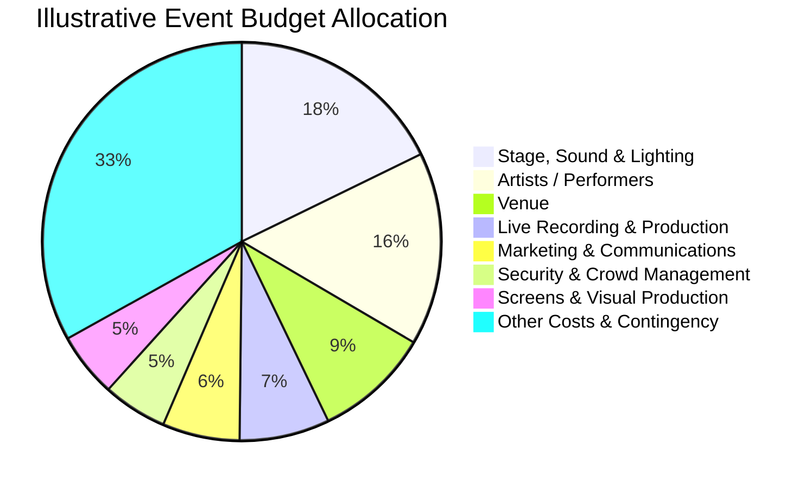

# Illustrative Event Budget – Warehouse Worship: The Gathering 2026

## 1. Purpose

This budget provides an illustrative financial framework for planning a large-scale worship event.

The figures have been developed for this portfolio case study to demonstrate budget planning, cost allocation and contingency management.

They are **not claimed to represent Warehouse Worship's actual event budget or expenditure**.

---

## 2. Budget Summary

| Cost Category | Illustrative Budget |
|---|---:|
| Venue | £45,000 |
| Stage, Sound & Lighting | £85,000 |
| Screens & Visual Production | £25,000 |
| Live Recording & Production | £35,000 |
| Artists / Performers | £75,000 |
| Security & Crowd Management | £25,000 |
| Staff / Stewards | £15,000 |
| Marketing & Communications | £30,000 |
| Ticketing | £8,000 |
| Transport & Logistics | £15,000 |
| Medical / Safety | £7,500 |
| Insurance / Licences / Compliance | £7,500 |
| Merchandise / Event Facilities | £5,000 |
| Catering / Hospitality | £12,500 |
| Signage / Branding | £5,000 |
| Cleaning / Waste | £7,500 |
| **Subtotal** | **£403,000** |
| **Contingency – 10%** | **£40,300** |
| **Total Illustrative Budget** | **£443,300** |

---

## 3. Budget Allocation

The largest proposed allocations are associated with production, artists, venue, recording and marketing.

This reflects the resource requirements that could be associated with a large-scale event involving significant technical production, multiple performers and a large attendee audience.

---

## 4. Budget Visualisation

The chart below provides a visual representation of the main budget allocations.

> **Chart note:** "Other Costs & Contingency" combines the remaining budget categories and the £40,300 contingency allowance. The chart is intended as a visual summary rather than a detailed financial statement.

---

## 5. Major Cost Areas

### 5.1 Stage, Sound & Lighting

**Illustrative allocation: £85,000**

This category represents the proposed cost of major production infrastructure, including:

- Stage infrastructure
- Audio systems
- Lighting systems
- Rigging
- Technical equipment
- Production crew

---

### 5.2 Artists / Performers

**Illustrative allocation: £75,000**

This represents a proposed allowance for artist and performer-related costs.

Potential costs could include:

- Performance fees
- Travel
- Accommodation
- Hospitality
- Artist support
- Technical requirements

---

### 5.3 Venue

**Illustrative allocation: £45,000**

Potential venue-related costs could include:

- Venue hire
- Event-space usage
- Facilities
- Venue staffing
- Cleaning requirements
- Operational support

---

### 5.4 Live Recording & Production

**Illustrative allocation: £35,000**

The case study identifies the event as functioning partly as a live recording environment.

Potential costs could include:

- Recording equipment
- Camera operators
- Audio recording
- Video production
- Post-production
- Technical crew

---

### 5.5 Marketing & Communications

**Illustrative allocation: £30,000**

Potential marketing expenditure could include:

- Digital advertising
- Social media promotion
- Creative content
- Graphic design
- Promotional materials
- Campaign management

---

### 5.6 Security & Crowd Management

**Illustrative allocation: £25,000**

Potential expenditure could include:

- Security personnel
- Crowd management
- Stewards
- Access control
- Event security equipment
- Operational coordination

---

## 6. Contingency

A **10% contingency allowance** has been included within the illustrative budget.

### Calculation

**Base budget: £403,000**

**Contingency: £403,000 × 10% = £40,300**

**Total budget: £403,000 + £40,300 = £443,300**

The contingency provides an allowance for unforeseen costs such as:

- Supplier price changes
- Additional staffing
- Technical requirements
- Transport changes
- Emergency requirements
- Operational changes

The contingency should only be used where additional expenditure is justified and appropriately authorised.

---

## 7. Budget Control

The project budget could be monitored through:

- Regular budget reviews
- Purchase-order tracking
- Supplier quotations
- Approved expenditure logs
- Variance analysis
- Contingency monitoring
- Change-control procedures

---

## 8. Budget Variance

Budget variance can be calculated using:

**Budget Variance = Actual Cost − Planned Cost**

A positive variance indicates expenditure above the planned budget, while a negative variance indicates expenditure below the planned budget.

Percentage variance can be calculated as:

**Variance % = (Actual Cost − Planned Cost) ÷ Planned Cost × 100**

---

## 9. Cost Control Process

A proposed cost-control process is:

**Cost Identified**

↓

**Supplier Quote / Cost Estimate**

↓

**Budget Check**

↓

**Approval**

↓

**Purchase / Commitment**

↓

**Invoice / Actual Cost**

↓

**Budget Update**

↓

**Variance Review**

↓

**Corrective Action if Required**

---

## 10. Financial Risks

Potential financial risks include:

| Risk | Potential Impact | Proposed Control |
|---|---|---|
| Supplier price increases | Increased expenditure | Obtain quotations early |
| Additional technical requirements | Budget pressure | Detailed technical specification |
| Artist changes | Additional costs | Early programme confirmation |
| Transport changes | Increased logistics costs | Confirm requirements early |
| Additional staffing | Increased labour costs | Workforce planning |
| Emergency expenditure | Contingency reduction | Maintain contingency |
| Scope changes | Budget growth | Change-control process |

---

## 11. Budget Assumptions

The illustrative budget assumes:

- A large-scale event environment
- Significant technical production
- Multiple performers
- Professional security and crowd-management provision
- Marketing and communications activity
- Transport and logistics requirements
- Live recording capability
- A 10% contingency allowance

These assumptions are created for the portfolio case study.

---

## 12. Budget Limitations

Actual event expenditure would depend on factors such as:

- Venue contract terms
- Supplier quotations
- Artist agreements
- Production specifications
- Staffing requirements
- Insurance requirements
- Transport arrangements
- Marketing strategy
- Ticketing arrangements

These details were not available as verified internal financial information for this case study.

---

## 13. Portfolio Application

This budget demonstrates the application of project-management principles to financial planning for a large-scale event.

It demonstrates:

- Cost estimation
- Budget allocation
- Contingency planning
- Cost control
- Variance management
- Financial risk identification
- Change control

---

## 14. Conclusion

The proposed budget provides a structured financial framework for considering the resources required to deliver a large-scale worship event.

The **£443,300 total is entirely illustrative** and should not be interpreted as Warehouse Worship's actual budget.

The budget should be reviewed throughout the project lifecycle to ensure expenditure remains aligned with approved scope, operational requirements and available resources.

---

> **Portfolio disclaimer:** All financial figures in this document are illustrative estimates created for this independent project-management case study. They do not represent actual Warehouse Worship financial information, supplier quotations, contracts or expenditure.
