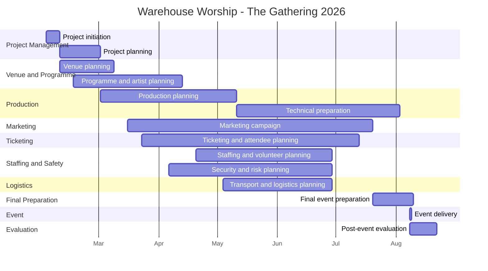

# Project Schedule – Warehouse Worship: The Gathering 2026

## 1. Purpose

This project schedule provides an illustrative 24-week framework for planning and delivering a large-scale worship event.

The schedule demonstrates how key project activities could be sequenced, monitored and coordinated from project initiation through to post-event evaluation.

The dates are proposed planning assumptions developed for this portfolio case study and do not represent Warehouse Worship's actual internal project schedule.

---

## 2. Project Lifecycle

The proposed project lifecycle is:

**Initiation → Planning → Development → Preparation → Event Delivery → Evaluation**

The different workstreams overlap because large-scale events require several activities to progress simultaneously.

---

## 3. Schedule Overview

| Phase | Main Activities | Indicative Period |
|---|---|---|
| Project Initiation | Scope, objectives and initial planning | Weeks 1–2 |
| Project Planning | WBS, stakeholders, risks and resources | Weeks 2–5 |
| Venue & Programme | Venue, artists and programme planning | Weeks 2–10 |
| Production | Technical and production planning | Weeks 5–18 |
| Marketing | Campaign development and promotion | Weeks 7–24 |
| Ticketing | Ticketing and attendee management | Weeks 8–23 |
| Staffing & Safety | Staffing, volunteers, security and risk | Weeks 11–22 |
| Logistics | Transport and event logistics | Weeks 14–21 |
| Final Preparation | Final checks and event readiness | Weeks 23–24 |
| Event Delivery | Event day | 8 August 2026 |
| Evaluation | KPI review and lessons learned | August 2026 |

---

## 4. Gantt Chart

The following Gantt chart provides an illustrative view of the proposed project lifecycle.

> **Schedule note:** All dates shown in the Gantt chart are illustrative planning assumptions created for this portfolio case study. They are not claimed to be Warehouse Worship's actual internal deadlines.

---

## 5. Key Milestones

| Milestone | Indicative Timing |
|---|---|
| Project initiated | February 2026 |
| Initial project planning completed | February 2026 |
| Venue planning established | March 2026 |
| Programme planning established | March 2026 |
| Production planning established | March 2026 |
| Marketing campaign active | March 2026 |
| Ticketing and attendee planning established | March 2026 |
| Staffing and safety planning | April 2026 |
| Logistics planning | May 2026 |
| Final event preparation | July–August 2026 |
| Event delivery | 8 August 2026 |
| Post-event evaluation | August 2026 |

---

## 6. Key Dependencies

Several activities have important dependencies.

### Venue → Production

Production planning depends on confirmed venue requirements, available space and technical constraints.

### Programme → Production

The programme affects:

- Stage requirements
- Audio requirements
- Lighting
- Screen content
- Artist changeovers
- Technical rehearsals

### Marketing → Ticketing

Marketing activity supports awareness and ticket conversion.

### Staffing → Operations

Staff and volunteer planning must be sufficiently developed before event-day operations can be finalised.

### Risk Management → Event Delivery

Risk controls should be reviewed before final operational readiness is confirmed.

### Logistics → Event Day

Transport and logistics arrangements should be confirmed before the event.

---

## 7. Critical Path Considerations

Potential activities affecting the critical delivery path include:

1. Venue readiness
2. Production preparation
3. Programme confirmation
4. Technical testing
5. Staffing and security preparation
6. Final safety checks
7. Event-day readiness

Delays in these areas could have a direct effect on event readiness.

The actual critical path would require the organiser's detailed activity durations, dependencies and resource constraints.

---

## 8. Schedule Management Approach

The schedule would be monitored through regular project reviews, with particular attention given to activities affecting the critical delivery path.

Potential schedule risks include:

- Supplier delays
- Programme changes
- Venue constraints
- Technical delays
- Staffing shortages
- Transport disruption
- Late approvals

Where a delay is identified, the project team should assess:

**Impact → Dependencies → Resources → Corrective Action → Revised Schedule**

---

## 9. Schedule Controls

Potential schedule controls include:

- Weekly project reviews during the main planning period
- Increased review frequency as the event approaches
- Milestone tracking
- Dependency monitoring
- Supplier progress checks
- Issue and action logs
- Change-control procedures
- Escalation of critical delays

---

## 10. Schedule Assumption

This schedule is an **illustrative project-management model** created for portfolio purposes.

It demonstrates how I would structure and monitor a large-scale event project. It should not be interpreted as the actual project schedule, internal deadlines or planning documentation of Warehouse Worship.
